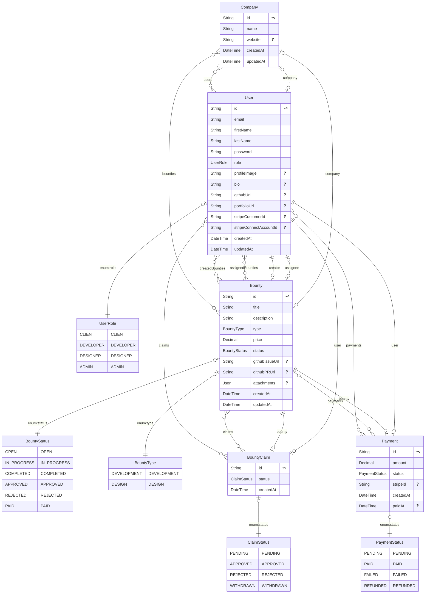

```mermaid
erDiagram

        UserRole {
            CLIENT CLIENT
DEVELOPER DEVELOPER
DESIGNER DESIGNER
ADMIN ADMIN
        }
    


        BountyStatus {
            OPEN OPEN
IN_PROGRESS IN_PROGRESS
COMPLETED COMPLETED
APPROVED APPROVED
REJECTED REJECTED
PAID PAID
        }
    


        BountyType {
            DEVELOPMENT DEVELOPMENT
DESIGN DESIGN
        }
    


        ClaimStatus {
            PENDING PENDING
APPROVED APPROVED
REJECTED REJECTED
WITHDRAWN WITHDRAWN
        }
    


        PaymentStatus {
            PENDING PENDING
PAID PAID
FAILED FAILED
REFUNDED REFUNDED
        }
    
  "Company" {
    String id "🗝️"
    String name 
    String website "❓"
    DateTime createdAt 
    DateTime updatedAt 
    }
  

  "User" {
    String id "🗝️"
    String email 
    String firstName 
    String lastName 
    String password 
    UserRole role 
    String profileImage "❓"
    String bio "❓"
    String githubUrl "❓"
    String portfolioUrl "❓"
    String stripeCustomerId "❓"
    String stripeConnectAccountId "❓"
    DateTime createdAt 
    DateTime updatedAt 
    }
  

  "Bounty" {
    String id "🗝️"
    String title 
    String description 
    BountyType type 
    Decimal price 
    BountyStatus status 
    String githubIssueUrl "❓"
    String githubPRUrl "❓"
    Json attachments "❓"
    DateTime createdAt 
    DateTime updatedAt 
    }
  

  "BountyClaim" {
    String id "🗝️"
    ClaimStatus status 
    DateTime createdAt 
    }
  

  "Payment" {
    String id "🗝️"
    Decimal amount 
    PaymentStatus status 
    String stripeId "❓"
    DateTime createdAt 
    DateTime paidAt "❓"
    }
  
    "Company" o{--}o "User" : "users"
    "Company" o{--}o "Bounty" : "bounties"
    "User" o|--|| "UserRole" : "enum:role"
    "User" o|--|o "Company" : "company"
    "User" o{--}o "Bounty" : "createdBounties"
    "User" o{--}o "Bounty" : "assignedBounties"
    "User" o{--}o "BountyClaim" : "claims"
    "User" o{--}o "Payment" : "payments"
    "Bounty" o|--|| "BountyType" : "enum:type"
    "Bounty" o|--|| "BountyStatus" : "enum:status"
    "Bounty" o|--|| "User" : "creator"
    "Bounty" o|--|o "User" : "assignee"
    "Bounty" o|--|o "Company" : "company"
    "Bounty" o{--}o "BountyClaim" : "claims"
    "Bounty" o{--}o "Payment" : "payments"
    "BountyClaim" o|--|| "Bounty" : "bounty"
    "BountyClaim" o|--|| "User" : "user"
    "BountyClaim" o|--|| "ClaimStatus" : "enum:status"
    "Payment" o|--|| "Bounty" : "bounty"
    "Payment" o|--|| "User" : "user"
    "Payment" o|--|| "PaymentStatus" : "enum:status"
```
