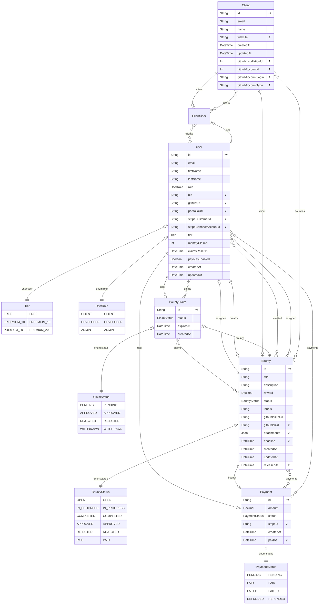

```mermaid
erDiagram

        Tier {
            FREE FREE
FREEMIUM_10 FREEMIUM_10
PREMIUM_20 PREMIUM_20
        }
    


        UserRole {
            CLIENT CLIENT
DEVELOPER DEVELOPER
ADMIN ADMIN
        }
    


        BountyStatus {
            OPEN OPEN
IN_PROGRESS IN_PROGRESS
COMPLETED COMPLETED
APPROVED APPROVED
REJECTED REJECTED
PAID PAID
        }
    


        ClaimStatus {
            PENDING PENDING
APPROVED APPROVED
REJECTED REJECTED
WITHDRAWN WITHDRAWN
        }
    


        PaymentStatus {
            PENDING PENDING
PAID PAID
FAILED FAILED
REFUNDED REFUNDED
        }
    
  "Client" {
    String id "🗝️"
    String email 
    String name 
    String website "❓"
    DateTime createdAt 
    DateTime updatedAt 
    Int githubInstallationId "❓"
    Int githubAccountId "❓"
    String githubAccountLogin "❓"
    String githubAccountType "❓"
    }
  

  "User" {
    String id "🗝️"
    String email 
    String firstName 
    String lastName 
    UserRole role 
    String bio "❓"
    String githubUrl "❓"
    String portfolioUrl "❓"
    String stripeCustomerId "❓"
    String stripeConnectAccountId "❓"
    Tier tier 
    Int monthyClaims 
    DateTime claimsResetAt 
    Boolean payoutsEnabled 
    DateTime createdAt 
    DateTime updatedAt 
    }
  

  "Bounty" {
    String id "🗝️"
    String title 
    String description 
    Decimal reward 
    BountyStatus status 
    String labels 
    String githubIssueUrl 
    String githubPrUrl "❓"
    Json attachments "❓"
    DateTime deadline "❓"
    DateTime createdAt 
    DateTime updatedAt 
    DateTime releasedAt "❓"
    }
  

  "BountyClaim" {
    String id "🗝️"
    ClaimStatus status 
    DateTime expiresAt 
    DateTime createdAt 
    }
  

  "Payment" {
    String id "🗝️"
    Decimal amount 
    PaymentStatus status 
    String stripeId "❓"
    DateTime createdAt 
    DateTime paidAt "❓"
    }
  

  "ClientUser" {

    }
  
    "Client" o{--}o "ClientUser" : "users"
    "Client" o{--}o "Bounty" : "bounties"
    "User" o|--|| "UserRole" : "enum:role"
    "User" o|--|| "Tier" : "enum:tier"
    "User" o{--}o "ClientUser" : "clients"
    "User" o{--}o "BountyClaim" : "claims"
    "User" o{--}o "Bounty" : "assigned"
    "User" o{--}o "Bounty" : "created"
    "User" o{--}o "Payment" : "payments"
    "Bounty" o|--|| "Client" : "client"
    "Bounty" o|--|| "User" : "creator"
    "Bounty" o|--|o "User" : "assignee"
    "Bounty" o|--|| "BountyStatus" : "enum:status"
    "Bounty" o{--}o "BountyClaim" : "claims"
    "Bounty" o{--}o "Payment" : "payments"
    "BountyClaim" o|--|| "Bounty" : "bounty"
    "BountyClaim" o|--|| "User" : "user"
    "BountyClaim" o|--|| "ClaimStatus" : "enum:status"
    "Payment" o|--|| "Bounty" : "bounty"
    "Payment" o|--|| "User" : "user"
    "Payment" o|--|| "PaymentStatus" : "enum:status"
    "ClientUser" o|--|| "Client" : "client"
    "ClientUser" o|--|| "User" : "user"
```
