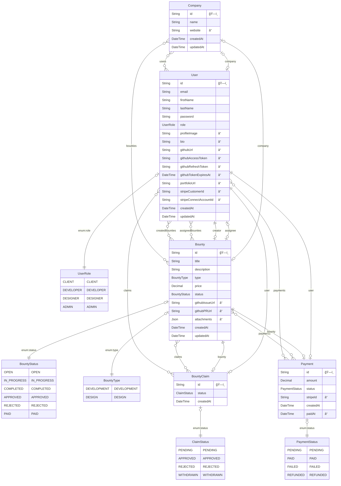

```mermaid
erDiagram

        UserRole {
            CLIENT CLIENT
DEVELOPER DEVELOPER
DESIGNER DESIGNER
ADMIN ADMIN
        }
    


        BountyStatus {
            OPEN OPEN
IN_PROGRESS IN_PROGRESS
COMPLETED COMPLETED
APPROVED APPROVED
REJECTED REJECTED
PAID PAID
        }
    


        BountyType {
            DEVELOPMENT DEVELOPMENT
DESIGN DESIGN
        }
    


        ClaimStatus {
            PENDING PENDING
APPROVED APPROVED
REJECTED REJECTED
WITHDRAWN WITHDRAWN
        }
    


        PaymentStatus {
            PENDING PENDING
PAID PAID
FAILED FAILED
REFUNDED REFUNDED
        }
    
  "Company" {
    String id "ğŸ—ï¸"
    String name 
    String website "â“"
    DateTime createdAt 
    DateTime updatedAt 
    }
  

  "User" {
    String id "ğŸ—ï¸"
    String email 
    String firstName 
    String lastName 
    String password 
    UserRole role 
    String profileImage "â“"
    String bio "â“"
    String githubUrl "â“"
    String githubAccessToken "â“"
    String githubRefreshToken "â“"
    DateTime githubTokenExpiresAt "â“"
    String portfolioUrl "â“"
    String stripeCustomerId "â“"
    String stripeConnectAccountId "â“"
    DateTime createdAt 
    DateTime updatedAt 
    }
  

  "Bounty" {
    String id "ğŸ—ï¸"
    String title 
    String description 
    BountyType type 
    Decimal price 
    BountyStatus status 
    String githubIssueUrl "â“"
    String githubPRUrl "â“"
    Json attachments "â“"
    DateTime createdAt 
    DateTime updatedAt 
    }
  

  "BountyClaim" {
    String id "ğŸ—ï¸"
    ClaimStatus status 
    DateTime createdAt 
    }
  

  "Payment" {
    String id "ğŸ—ï¸"
    Decimal amount 
    PaymentStatus status 
    String stripeId "â“"
    DateTime createdAt 
    DateTime paidAt "â“"
    }
  
    "Company" o{--}o "User" : "users"
    "Company" o{--}o "Bounty" : "bounties"
    "User" o|--|| "UserRole" : "enum:role"
    "User" o|--|o "Company" : "company"
    "User" o{--}o "Bounty" : "createdBounties"
    "User" o{--}o "Bounty" : "assignedBounties"
    "User" o{--}o "BountyClaim" : "claims"
    "User" o{--}o "Payment" : "payments"
    "Bounty" o|--|| "BountyType" : "enum:type"
    "Bounty" o|--|| "BountyStatus" : "enum:status"
    "Bounty" o|--|| "User" : "creator"
    "Bounty" o|--|o "User" : "assignee"
    "Bounty" o|--|o "Company" : "company"
    "Bounty" o{--}o "BountyClaim" : "claims"
    "Bounty" o{--}o "Payment" : "payments"
    "BountyClaim" o|--|| "Bounty" : "bounty"
    "BountyClaim" o|--|| "User" : "user"
    "BountyClaim" o|--|| "ClaimStatus" : "enum:status"
    "Payment" o|--|| "Bounty" : "bounty"
    "Payment" o|--|| "User" : "user"
    "Payment" o|--|| "PaymentStatus" : "enum:status"
```
