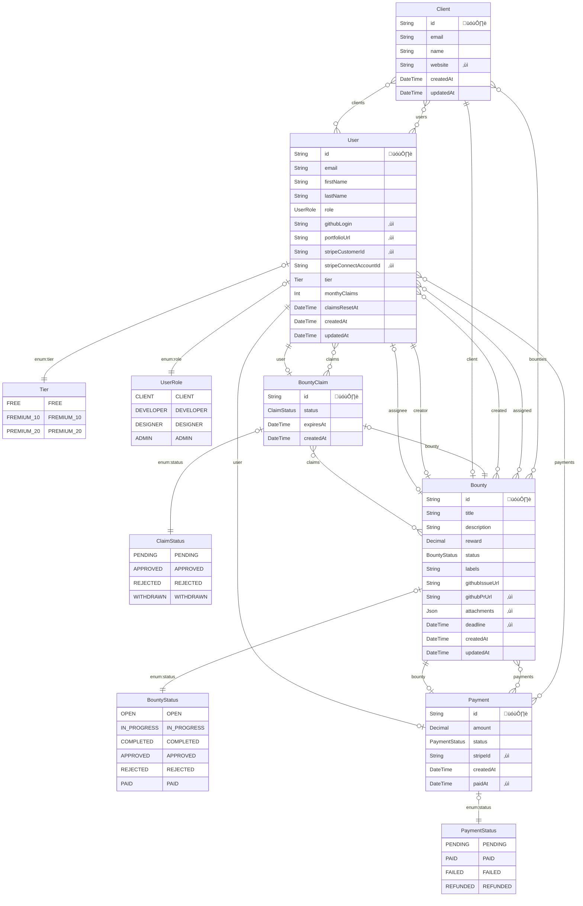

```mermaid
erDiagram

        Tier {
            FREE FREE
FREMIUM_10 FREMIUM_10
PREMIUM_20 PREMIUM_20
        }
    


        UserRole {
            CLIENT CLIENT
DEVELOPER DEVELOPER
DESIGNER DESIGNER
ADMIN ADMIN
        }
    


        BountyStatus {
            OPEN OPEN
IN_PROGRESS IN_PROGRESS
COMPLETED COMPLETED
APPROVED APPROVED
REJECTED REJECTED
PAID PAID
        }
    


        ClaimStatus {
            PENDING PENDING
APPROVED APPROVED
REJECTED REJECTED
WITHDRAWN WITHDRAWN
        }
    


        PaymentStatus {
            PENDING PENDING
PAID PAID
FAILED FAILED
REFUNDED REFUNDED
        }
    
  "Client" {
    String id "🗝️"
    String email 
    String name 
    String website "‚ùì"
    DateTime createdAt 
    DateTime updatedAt 
    }
  

  "User" {
    String id "🗝️"
    String email 
    String firstName 
    String lastName 
    UserRole role 
    String githubLogin "‚ùì"
    String portfolioUrl "‚ùì"
    String stripeCustomerId "‚ùì"
    String stripeConnectAccountId "‚ùì"
    Tier tier 
    Int monthyClaims 
    DateTime claimsResetAt 
    DateTime createdAt 
    DateTime updatedAt 
    }
  

  "Bounty" {
    String id "🗝️"
    String title 
    String description 
    Decimal reward 
    BountyStatus status 
    String labels 
    String githubIssueUrl 
    String githubPrUrl "‚ùì"
    Json attachments "‚ùì"
    DateTime deadline "‚ùì"
    DateTime createdAt 
    DateTime updatedAt 
    }
  

  "BountyClaim" {
    String id "🗝️"
    ClaimStatus status 
    DateTime expiresAt 
    DateTime createdAt 
    }
  

  "Payment" {
    String id "🗝️"
    Decimal amount 
    PaymentStatus status 
    String stripeId "‚ùì"
    DateTime createdAt 
    DateTime paidAt "‚ùì"
    }
  
    "Client" o{--}o "User" : "users"
    "Client" o{--}o "Bounty" : "bounties"
    "User" o|--|| "UserRole" : "enum:role"
    "User" o|--|| "Tier" : "enum:tier"
    "User" o{--}o "Client" : "clients"
    "User" o{--}o "BountyClaim" : "claims"
    "User" o{--}o "Bounty" : "assigned"
    "User" o{--}o "Bounty" : "created"
    "User" o{--}o "Payment" : "payments"
    "Bounty" o|--|| "Client" : "client"
    "Bounty" o|--|| "User" : "creator"
    "Bounty" o|--|o "User" : "assignee"
    "Bounty" o|--|| "BountyStatus" : "enum:status"
    "Bounty" o{--}o "BountyClaim" : "claims"
    "Bounty" o{--}o "Payment" : "payments"
    "BountyClaim" o|--|| "Bounty" : "bounty"
    "BountyClaim" o|--|| "User" : "user"
    "BountyClaim" o|--|| "ClaimStatus" : "enum:status"
    "Payment" o|--|| "Bounty" : "bounty"
    "Payment" o|--|| "User" : "user"
    "Payment" o|--|| "PaymentStatus" : "enum:status"
```
